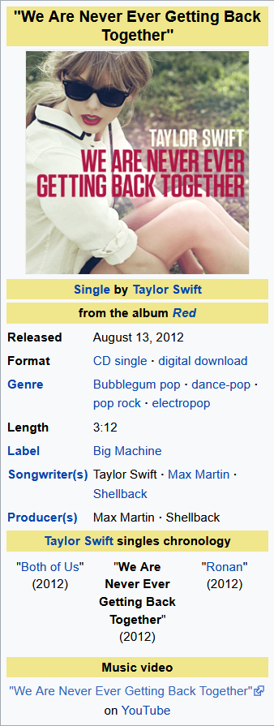

# Evolution of music taste in Spain
Using the top 40 list elaborated by the Spanish music radio *Los 40 Principales* I attempt to study the evolution of musical taste in Spain in terms of genre. [Similar projects](https://thedataface.com/2016/09/culture/genre-lifecycles) can be found on the web, mine is just a national version. I expect to see a swift towards *reggaetón* in the decade of 2010s.

## Scraping

The whole project is coded with R. We use the  [rvest](https://rvest.tidyverse.org/) package for scrapping., to obtain the data from the [webpage](https://los40.com/lista40/2005/1) where the playlist is.  The scraper for the gets every top 40 playlist since 2005 (first year on record).

### Known issues

* The program sometimes halts during execution flagging an error  like`in open.connection(x, "rb") : HTTP error 503`. Fortunately, since the loop is not executed inside a function all variables are global variables and one can look up the value for `k`, which is the loop variable, and start the loop from `k = 347` for example. I will try to automate the process so that no manual restart is needed.

## Classification

My initial idea is to use Wikipedia to get the genre for every song. The Wikipedia page for a song, eg. *We are never ever getting back together* by Taylor Swift, has a table with song attributes. You can see that there is a row **Genre** from which to extract the information. 

Since there is no way to tell which genre is more representative for the song  (I don't believe the order in which they appear is determinant), I will use all of them. All genres will be written in the same cell as a string eg. *'Bubblegum pop, dance-pop, pop rock, electropop'* and afterwards when reading the genres in the analysis phase, we will split the string by commas.

## Plotting

Expect to see animated plots using the [gganimate](https://gganimate.com/) package as well as [Plotly](https://plotly.com/r/). 

